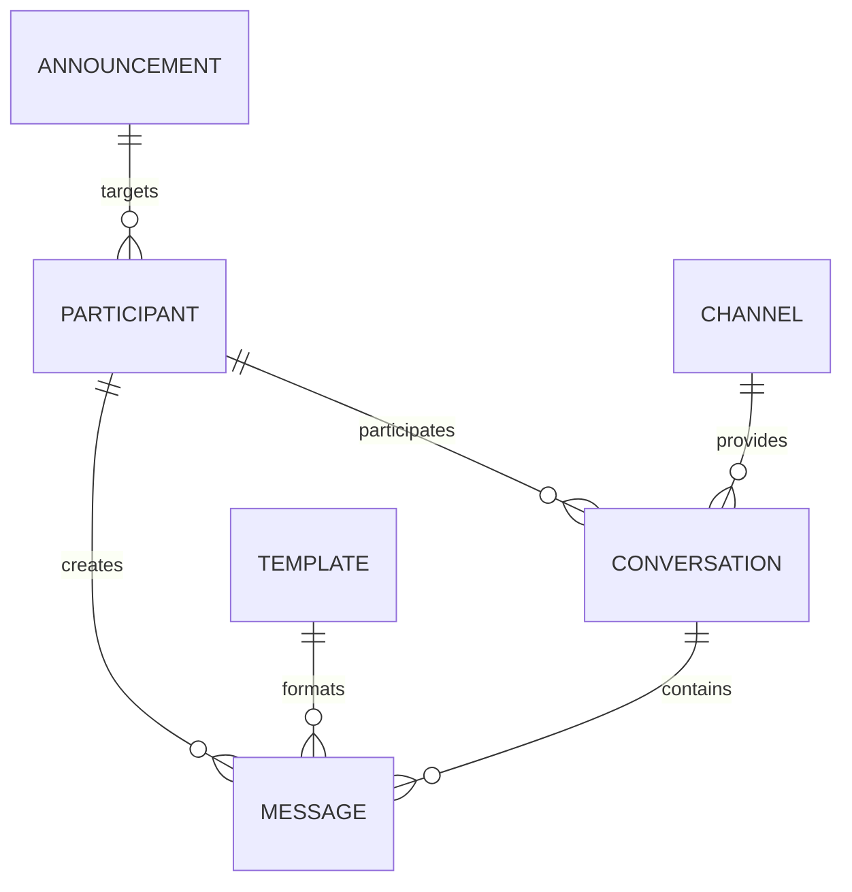

# EPIC-COM-001 — Domain Model

## Overview

The Communication Plugin introduces a dedicated domain model
for representing communication concepts inside FamilyOS.

The domain model defines the core entities, relationships,
and responsibilities required to manage communication data.

## Core Domain Concepts

The Communication Plugin includes:

| Concept | Responsibility |
|---|---|
| Conversation | Represents a structured communication exchange |
| Message | Represents an individual communication element |
| Channel | Defines the communication medium |
| Participant | Represents communication actors |
| Preference | Defines communication choices |
| Template | Defines reusable communication structures |
| Announcement | Represents family-wide communication |

## Domain Relationships

## Conversation

A Conversation represents a structured communication exchange.

### Responsibilities

- Maintain communication context
- Associate participants
- Organize related messages
- Preserve communication history

## Message

A Message represents an individual communication element.

### Responsibilities

- Store communication information
- Identify sender and recipients
- Maintain creation information
- Support communication history

## Channel

A Channel represents the medium used for communication.

### Examples

- Internal family communication
- Email
- Messaging service
- Notification channel

The domain does not depend on external providers.

## Participant

A Participant represents an actor involved in communication.

### Participants may include

- Family members
- External contacts
- Authorized users

## Communication Preference

Communication Preferences define how communication should
be handled.

### Examples

- Preferred channel
- Notification choices
- Communication availability

## Communication Template

Templates provide reusable communication structures.

### Examples

- Family announcements
- Standard messages
- Communication workflows

## Announcement

Announcements represent communication intended for a wider
family audience.

### Responsibilities

- Define target participants
- Provide structured information
- Support family communication workflows

## Domain Rules

The Communication domain must ensure:

- Communication ownership is explicit
- Sensitive information remains protected
- Domain objects preserve consistency
- External providers do not control domain behavior

## Future Evolution

Future extensions may introduce:

- Communication threads
- Attachments
- Delivery tracking
- Communication automation

All future extensions must preserve the Communication domain
boundary.

